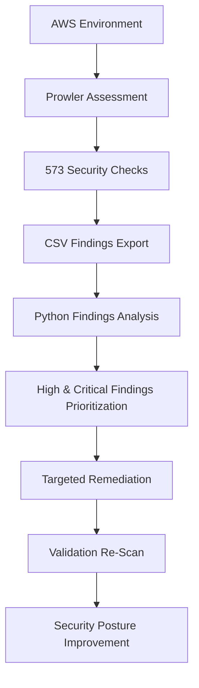

# AWS Security Posture Assessment & Targeted Remediation
### CIS AWS Foundations Benchmark Aligned | Prowler v5.22.0

**Tools:** Prowler v5.22.0 · Python 3 (Pandas) · AWS IAM · AWS CloudTrail · AWS S3
**Framework:** CIS AWS Foundations Benchmark · 573 Checks · All AWS Regions

> Sensitive identifiers including AWS Account IDs and resource ARNs have been redacted from all reports and screenshots in accordance with security best practices.

---

## Executive Summary

Performed a CIS-aligned security assessment of an AWS environment using Prowler (573 checks), identified high-impact IAM, CloudTrail, and S3 misconfigurations, and applied targeted remediation based on attacker impact. Security pass rate improved from 39.58% to 54.26%, with critical findings reduced by 75% and high findings reduced by 77% through focused remediation and validation.

---

## Results at a Glance

| Metric | Before | After | Improvement |
|---|---|---|---|
| Pass Rate | 39.58% | 54.26% | **+14.68 pp** |
| Critical Findings | 4 | 1 | **−3 (75%)** |
| High Findings | 22 | 5 | **−17 (77%)** |
| Failed Checks | 141 | 115 | **−26** |

Four targeted fixes. 75% of critical findings resolved.

---

## Assessment Workflow



---

## Table of Contents

- [Overview](#overview)
- [Project Structure](#project-structure)
- [Methodology](#methodology)
- [Phase 1 — Baseline Scan](#phase-1--baseline-scan)
- [Phase 2 — Python Findings Analysis](#phase-2--python-findings-analysis)
- [Phase 3 — Critical Findings](#phase-3--critical-findings)
- [Phase 4 — Remediation & Evidence](#phase-4--remediation--evidence)
- [Phase 5 — Re-Scan Validation](#phase-5--re-scan-validation)
- [Before vs After](#before-vs-after)
- [CIS Benchmark Mapping](#cis-benchmark-mapping)
- [Scope & Limitations](#scope--limitations)
- [Key Takeaways](#key-takeaways)

---

## Overview

This project conducts a structured security posture assessment on a personal AWS account using Prowler — an industry-standard CSPM tool. The workflow follows a real-world cloud security engagement model: automated baseline scan → Python-based triage → risk-prioritized remediation → validated re-scan.

The assessment targets three attack surfaces most exploited in cloud breaches: **identity and access**, **audit logging**, and **data exposure**. Rather than resolving all 141 failures, remediation was deliberately scoped to four findings with the highest exploitable impact — demonstrating risk-based prioritization over checkbox compliance.

---

## Project Structure

```
aws-security-posture-assessment/
│
├── README.md
├── scripts/
│   └── filter_findings.py
├── reports/
│   ├── baseline_security_report.txt
│   ├── remediation_security_report.txt
│   └── high_critical_findings.csv
└── screenshots/
    ├── 01_baseline_scan.png
    ├── 02_python_output.png
    ├── 03_root_mfa_finding.png
    ├── 04_iam_finding.png
    ├── 05_s3_finding.png
    ├── 06_root_mfa_after.png
    ├── 07_iam_policy_fix.png
    ├── 08_cloudtrail_enabled.png
    ├── 09_s3_block.png
    └── 10_remediation_scan.png
```

> Raw Prowler CSV outputs are excluded — they contain account-specific resource identifiers. Sanitized reports are provided in `reports/` instead.

---

## Methodology

The assessment follows a five-phase workflow designed to mirror professional cloud security engagements — from initial discovery through validated remediation.

```
Baseline Scan (573 checks, all regions)
        ↓
Python Triage (filter HIGH/CRITICAL, export prioritized findings)
        ↓
Risk Assessment (attacker impact per finding)
        ↓
Targeted Remediation (4 fixes: IAM + CloudTrail + S3)
        ↓
Re-Scan Validation (before vs after metrics)
```

Key principle: **risk-based prioritization** — maximum security improvement per unit of effort, not exhaustive remediation.

---

## Phase 1 — Baseline Scan

```powershell
python -m prowler aws --output-formats csv html -o ./baseline-scan/
```

| Metric | Value |
|---|---|
| Total Checks | 573 |
| Failed | **141 (58.75%)** |
| Passed | 95 (39.58%) |
| Critical | 4 |
| High | 22 |
| Medium | 66 |
| Low | 49 |

A default AWS account with minimal resources failed nearly 60% of all checks — including four CRITICAL findings exploitable without elevated access.


---

## Phase 2 — Python Findings Analysis

240 raw findings manually reviewed is inefficient and error-prone. A Python script automates triage — loading the Prowler CSV, filtering to CRITICAL and HIGH failures, and exporting a prioritized list with a structured summary report.

```bash
python scripts/filter_findings.py
```

**Result:** 240 findings → **10 actionable HIGH/CRITICAL issues**

The script applies the same filtering logic used in real SOC triage workflows — cut through volume, surface what matters, act on what has impact.


---

## Phase 3 — Critical Findings

> Remediation was intentionally scoped to four findings with the highest attacker impact, reflecting real-world risk prioritization over exhaustive compliance.

---

### Finding 1 — Root Account MFA Disabled

| | |
|---|---|
| **Check ID** | `iam_root_mfa_enabled` |
| **Severity** | 🔴 Critical |
| **CIS Control** | CIS AWS 1.1 |

The root account cannot be restricted by IAM policies and holds unrestricted access to every service, resource, and billing function. Without MFA, it is protected only by a password. Compromise of a root account without MFA can result in complete administrative control of the AWS environment, making it one of the highest-impact cloud security findings.

**Remediation:** Enabled Virtual MFA on the root account.


---

### Finding 2 — IAM User with AdministratorAccess

| | |
|---|---|
| **Check ID** | `iam_user_administrator_access_policy` |
| **Severity** | 🔴 Critical |
| **CIS Control** | CIS AWS 1.16 |

The audit user held `AdministratorAccess` (`*:*`) with long-lived static access keys — maximum blast radius credentials. Any key compromise grants an attacker full administrative control instantly. An audit user requires read access only. This directly violates least privilege and represents one of the most common initial access vectors in AWS compromise scenarios.

**Remediation:** Removed AdministratorAccess and applied SecurityAudit read-only policy.


---

### Finding 3 — CloudTrail Not Enabled

| | |
|---|---|
| **Check ID** | `cloudtrail_multi_region_enabled` |
| **Severity** | 🟠 High |
| **CIS Control** | CIS AWS 3.1 |

No CloudTrail trail meant every API call — IAM changes, resource creation, login events — went completely unrecorded across all regions. Without CloudTrail, security teams lose visibility into account activity, significantly limiting detection, investigation, and forensic capabilities.

**Remediation:** Enabled multi-region CloudTrail logging with S3 log delivery and file validation.

---

### Finding 4 — S3 Block Public Access Disabled

| | |
|---|---|
| **Check ID** | `s3_account_level_public_access_blocks` |
| **Severity** | 🟠 High |
| **CIS Control** | CIS AWS 2.1 |

Without account-level Block Public Access, any bucket can be inadvertently exposed via misconfigured ACLs or policies — including buckets created in the future. Public S3 contents are indexed by third-party scanners within hours. S3 misconfiguration is responsible for some of the largest data breaches in cloud history.

**Remediation:** Enabled account-level Block Public Access across all four controls.


---

## Phase 4 — Remediation & Evidence

Remediation was ordered by attack surface priority: **identity first, logging second, data exposure third** — the same sequence used in real incident response.

---

### Fix 1 — Root MFA Enabled
- IAM → Security credentials → Assign MFA device
- Virtual MFA configured via Google Authenticator
- Verified with two consecutive OTPs

**Impact:** Eliminates single-factor root account takeover.


---

### Fix 2 — IAM Least Privilege Enforced
- Detached `AdministratorAccess` from audit user
- Attached `SecurityAudit` read-only policy

**Impact:** Credential blast radius reduced from full admin to read-only access.


---

### Fix 3 — CloudTrail Enabled
- Multi-region trail created covering all AWS regions
- S3 log delivery configured with file validation enabled

**Impact:** Full API visibility restored. All account activity is now logged and tamper-evident.


---

### Fix 4 — S3 Public Access Blocked
- All four account-level Block Public Access controls enabled
- Bucket-level restrictions applied and verified
- No public ACLs or policies remain active

**Impact:** Data exposure vector closed at both account and bucket level. Future buckets inherit restrictions by default.


---

## Phase 5 — Re-Scan Validation

```powershell
python -m prowler aws --output-formats csv html -o ./remediation-scan/
```

| Metric | Value |
|---|---|
| Failed | **115 (44.57%)** |
| Passed | 140 (54.26%) |
| Critical | 1 |
| High | 5 |

> **Note on finding count:** Total findings increased from 240 to 258 — expected, not a regression. Enabling CloudTrail introduced new detectable resources into Prowler's scope. Pass rate is the correct improvement metric.


---

## Before vs After

| Metric | Baseline | Post-Remediation | Delta |
|---|---|---|---|
| Pass Rate | 39.58% | 54.26% | **+14.68 pp** |
| Failed | 141 | 115 | **−26** |
| Critical | 4 | 1 | **−3 (75% reduction)** |
| High | 22 | 5 | **−17 (77% reduction)** |
| CloudTrail Failures | 36 | 8 | **−28** |
| IAM Failures | 18 | 15 | **−3** |

Four fixes resolved 75% of critical findings and 77% of high findings — the case for risk-based prioritization in practice.

---

## CIS Benchmark Mapping

| Finding | CIS Control | Description | Status |
|---|---|---|---|
| Root MFA disabled | CIS 1.1 | Enable MFA for the root account | ✅ Remediated |
| AdministratorAccess on IAM user | CIS 1.16 | Ensure IAM policies are attached only to groups or roles | ✅ Remediated |
| CloudTrail not enabled | CIS 3.1 | Ensure CloudTrail is enabled in all regions | ✅ Remediated |
| S3 public access not blocked | CIS 2.1 | Ensure S3 Block Public Access is configured | ✅ Remediated |

---

## Scope & Limitations

The following findings were intentionally excluded — not because they were overlooked, but because they are inapplicable to a standalone personal account:

- **AWS Organizations SCP controls** — only available within an AWS Organization. A standalone account cannot implement these regardless of configuration effort.
- **Firewall Manager (FMS)** — requires AWS Business or Enterprise Support subscription. Not available on personal accounts.
- **Hardware MFA** — CIS recommends hardware MFA for root accounts. Virtual MFA was applied instead, which satisfies the control intent for a personal account environment.
- **AccessAnalyzer, Bedrock guardrails, CloudWatch metric filters** — legitimate production controls that fall outside the identity, logging, and data exposure scope of this assessment.

The 115 remaining failures post-remediation are almost entirely composed of these enterprise-scale controls. All four in-scope findings — those with direct, exploitable attacker impact — were fully resolved.

---

## Key Takeaways

- **Default AWS accounts fail ~60% of security checks** without any prior hardening
- **Four fixes resolved 75% of critical risk** — risk-based prioritization outperforms exhaustive remediation
- **Python automation cut triage time significantly** — 240 findings reduced to 10 actionable priorities
- **Logging is foundational** — without CloudTrail, no other security control can be investigated after the fact
- **Finding count can increase post-remediation** — enabling services expands detectable scope; pass rate is the correct metric

---

## Author

**Shashank** · Cybersecurity Student · Cloud Security Enthusiast
GitHub: [@Shashankk2601](https://github.com/Shashankk2601)

---

*Conducted on a personal AWS account in a controlled environment for educational and portfolio purposes.*
